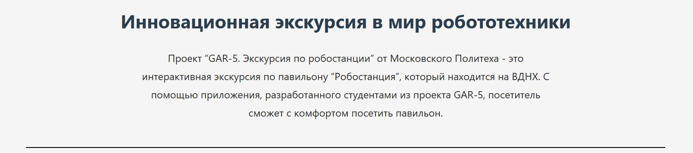
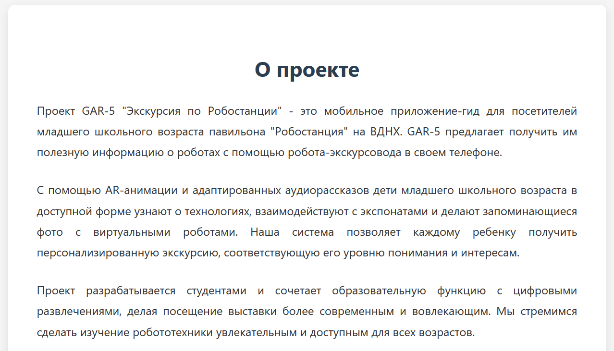
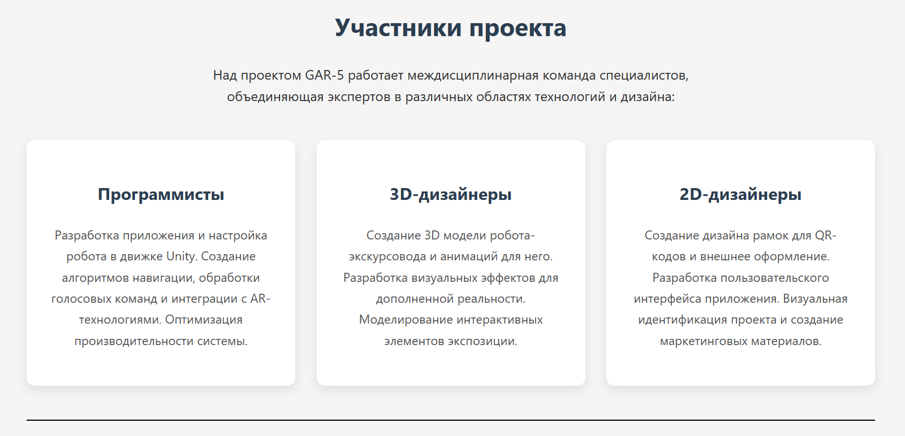
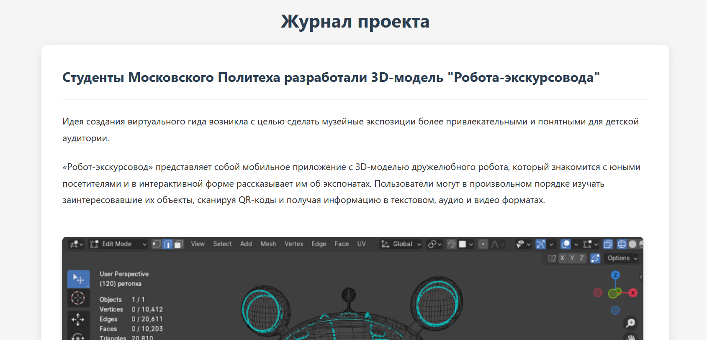
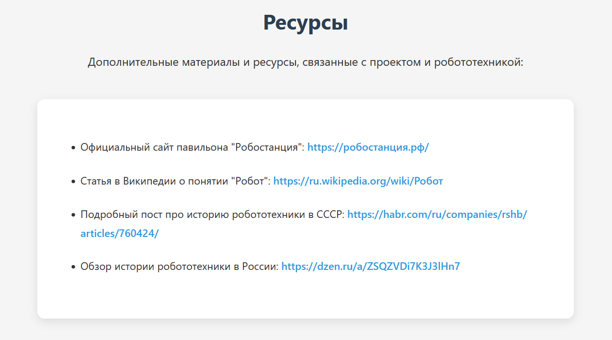

## Базовая часть
Для начала, скачиваем Git и Hugo, для того, чтобы сделать статический веб-сайт. После чего, заходим на сайт с темами для сайта Hugo и ищем устраивающую нас тему с интересным дизайном. После этого, заходим в PowerShell и начинаем создавать сайт согласно курсу Hugo Quick Start: https://gohugo.io/getting-started/quick-start/.

После выполнения курса Hugo Quick Start, вводим команду hugo, сайт сохраняется в папку public. После этого загружаем файлы на GitHub в папку site_folder.
### Структура сайта
### Header

### Аннотация сайта

### О проекте

### Участники проекта

### Журнал проекта

### Ресурсы

### Footer

