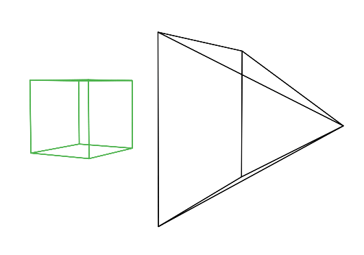
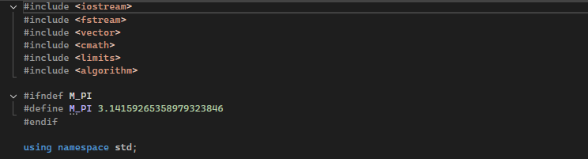

## Вариативная часть
### Начало работы
Запускаем Visual Studio Code и создаем консольное приложение, после чего подключаем требующиеся библиотеки к нашему проекту в Visual Studio Code и начинаем писать 3D визуализатор. 
Будем писать код согласно статье, размещенной на сайте Scratch A Pixel, расположенной на сайте https://www.scratchapixel.com/lessons/3d-basic-rendering/introduction-to-ray-tracing/how-does-it-work. В этой статье объясняется довольно трудный принцип работы метода преобразования 3D модели в изображение Ray tracing. После прочтения статьи, начинаем писать программу.
### Принцип работы Ray tracing

Для создания изображения необходима двумерная поверхность, которая выступает в качестве среды для проецирования. Концептуально это можно представить в виде разреза пирамиды, вершина которой расположена перед глазами зрителя и простирается в направлении прямой видимости. Этот концептуальный фрагмент называется плоскостью изображения, что-то вроде холста для художников. Он служит сценой, на которую проецируется трехмерная сцена для формирования двумерного изображения. Этот фундаментальный принцип лежит в основе процесса создания изображений на различных носителях, от фотопленки или цифрового сенсора в фотоаппаратах до традиционных полотен художников, иллюстрируя универсальное применение этой концепции в визуальном представлении.

Перспективная проекция - это техника, которая переводит трехмерные объекты в двухмерную плоскость, создавая иллюзию глубины и пространства на плоской поверхности. Представьте, что вы хотите изобразить куб на чистом холсте. Процесс начинается с проведения линий от каждого угла куба к глазу зрителя. Там, где каждая линия пересекает плоскость изображения — плоскую поверхность, похожую на холст или экран фотоаппарата, — делается отметка. Например, если угол куба с надписью c0 соединяется с углами c1, c2 и c3, то их проекция на холст приведет к точкам c0', c1', c2' и c3'. Затем между этими проецируемыми точками на холсте рисуются линии, представляющие ребра куба, например, от c0' до c1' и от c0' до c2'.
### Написание кода

Этот фрагмент кода реализует класс Vec3 для работы с 3D-векторами. Он хранит компоненты x, y, z и предоставляет конструкторы для создания векторов, операторы для базовых операций, методы для скалярного и векторного произведений, а также функции для нормализации вектора и вычисления его длины. Однако в коде есть ошибки: операторы = перегружены некорректно, а также отсутствует проверка деления на ноль. Код полезен для математических расчётов в графике или физике, но требует исправлений.
