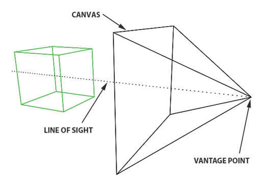

## Вариативная часть
### Начало работы
Запускаем Visual Studio Code и создаем консольное приложение, после чего подключаем требующиеся библиотеки к нашему проекту в Visual Studio Code и начинаем писать 3D визуализатор. 
Будем писать код согласно статье, размещенной на сайте Scratch A Pixel, расположенной на сайте https://www.scratchapixel.com/lessons/3d-basic-rendering/introduction-to-ray-tracing/how-does-it-work. В этой статье объясняется довольно трудный принцип работы метода преобразования 3D модели в изображение Ray tracing. После прочтения статьи, начинаем писать программу.
### Принцип работы Ray tracing

Для создания изображения необходима двумерная поверхность, которая выступает в качестве среды для проецирования. Концептуально это можно представить в виде разреза пирамиды, вершина которой расположена перед глазами зрителя и простирается в направлении прямой видимости. Этот концептуальный фрагмент называется плоскостью изображения, что-то вроде холста для художников. Он служит сценой, на которую проецируется трехмерная сцена для формирования двумерного изображения. Этот фундаментальный принцип лежит в основе процесса создания изображений на различных носителях, от фотопленки или цифрового сенсора в фотоаппаратах до традиционных полотен художников, иллюстрируя универсальное применение этой концепции в визуальном представлении.
