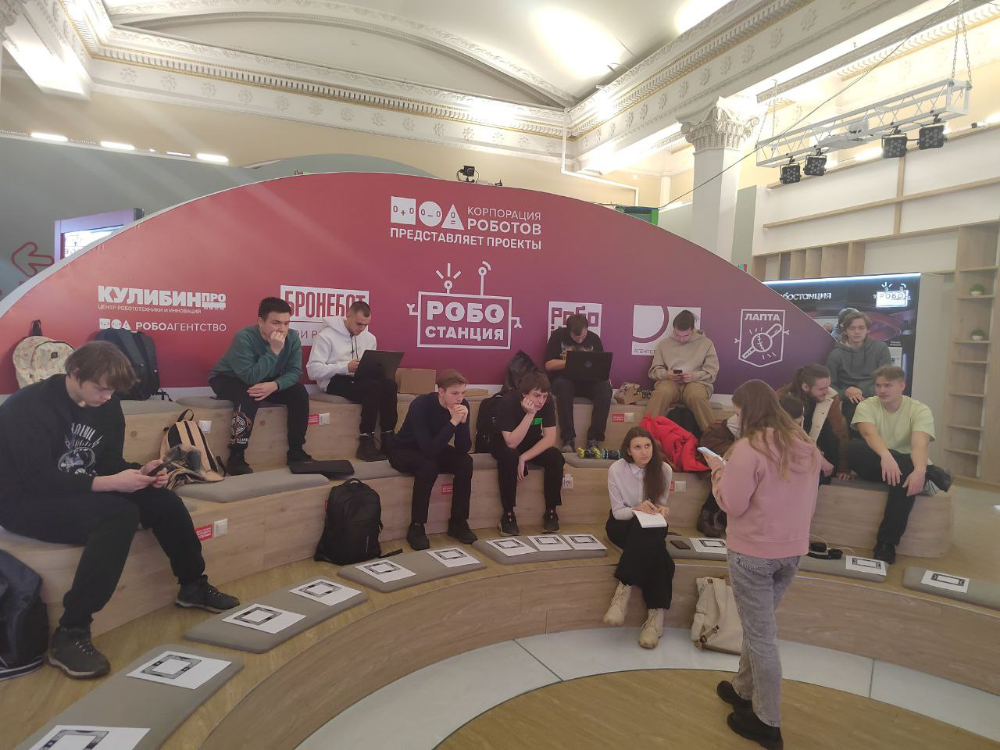

## Посещение мероприятия 
Каждую среду в лектории Сбера в павильоне "Робостанция" на ВДНХ в 17:50 проводились встречи с партнёрами. На этих занятиях мы обсуждали с инженерами и работодателями: вид приложения, 3D-модели, дизайн приложения и многие другие детали итогового продукта, которые заказчик в лице ООО "Корпорация роботов" хотели видеть в качестве итогового продукта.
### Встреча в лектории Робостанции

